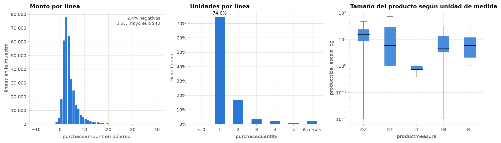
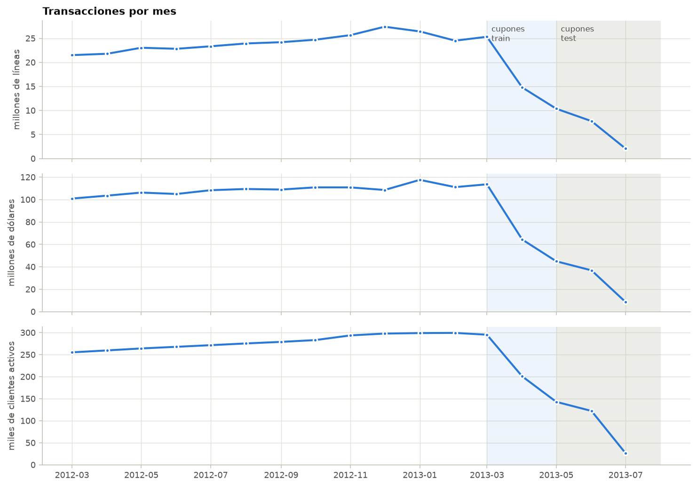
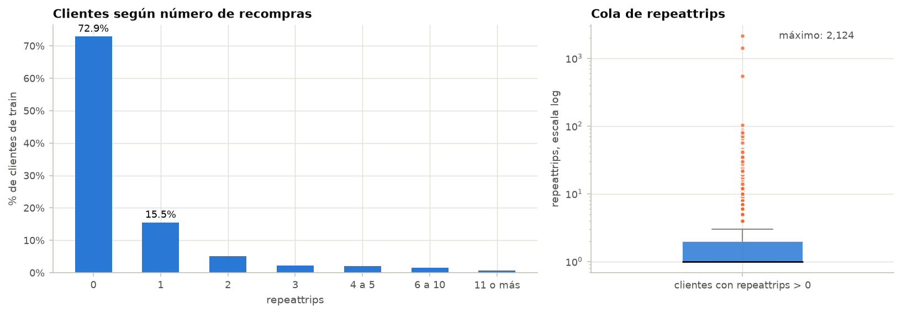
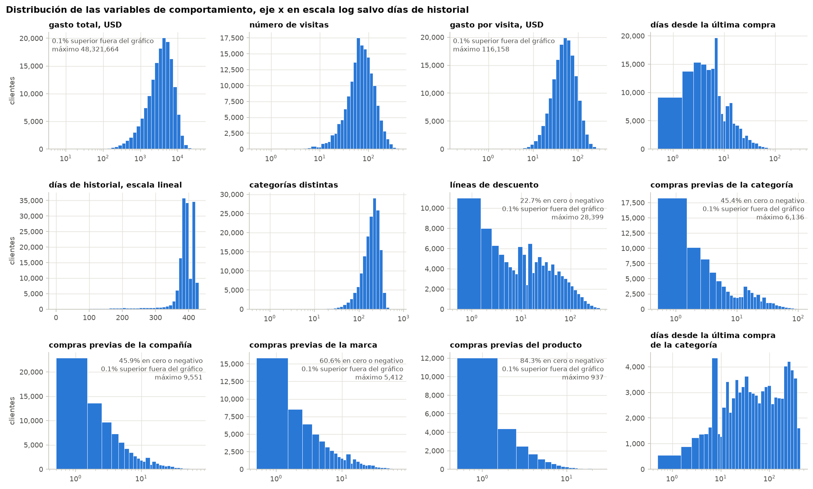
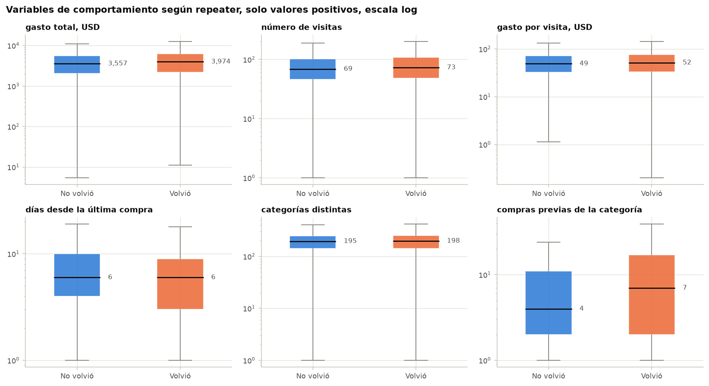
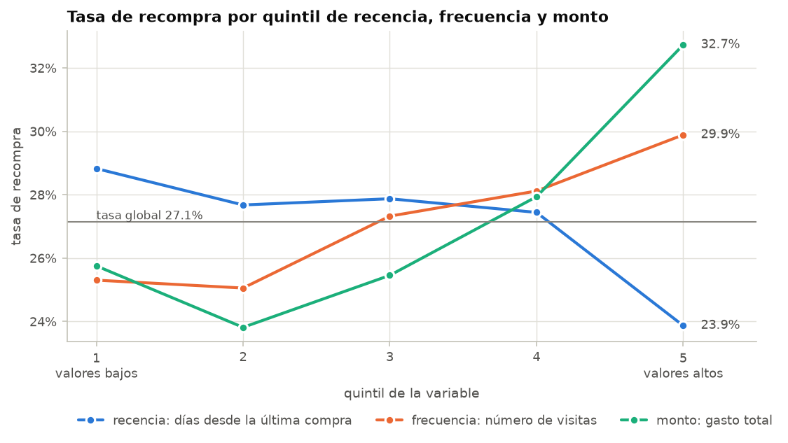
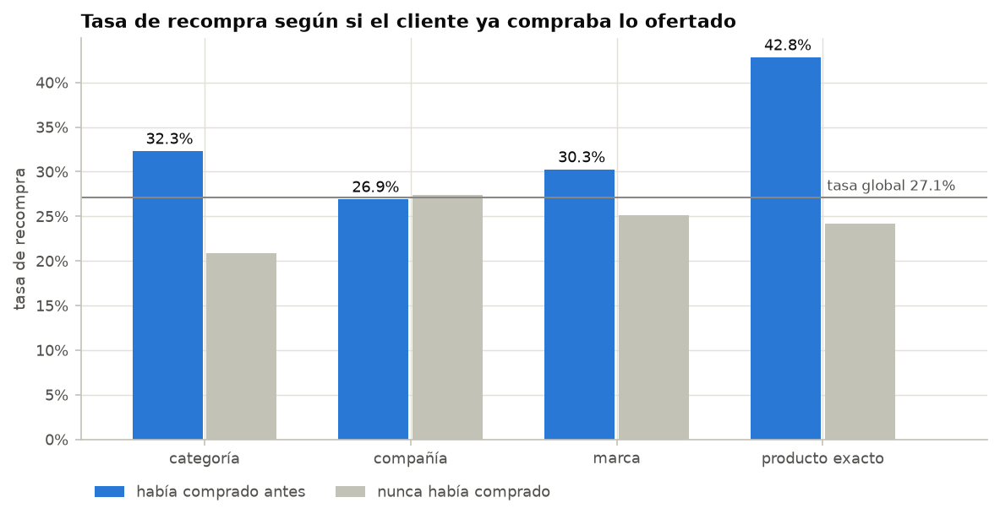
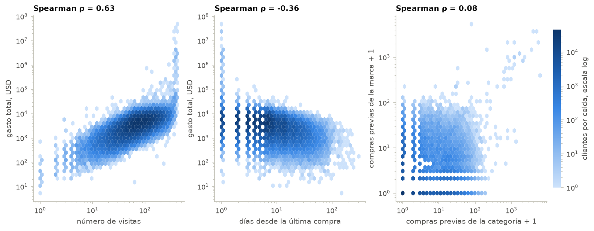
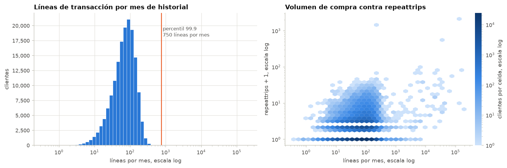

# 3. Análisis exploratorio cuantitativo

Esta sección estudia con estadística descriptiva las variables cuantitativas, que son las variables crudas de las transacciones, la variable de conteo `repeattrips` y las variables de comportamiento construidas en la sección 2. También analiza su relación con la recompra, los valores faltantes, los valores atípicos y qué tan comparables son train y test. El procedimiento completo está en `notebooks/03_eda_cuantitativo.ipynb` y las tablas en `results/tables/03_*.csv`.

## 3.1 Variables crudas de las transacciones

La media, la desviación, los extremos y los conteos son exactos, calculados sobre las 349.7 millones de filas. Los percentiles se estimaron con una muestra aleatoria del 0.1%, que con 349,163 filas es suficiente para ese fin.

| Variable | Media | Desviación | Mínimo | Percentil 25 | Mediana | Percentil 75 | Percentil 99 | Máximo |
|---|---:|---:|---:|---:|---:|---:|---:|---:|
| `purchaseamount` | 4.49 | 878.93 | -8,593,791 | 1.99 | 3.18 | 4.99 | 25.19 | 58,658.76 |
| `purchasequantity` | 1.67 | 40.31 | -32,255 | 1 | 1 | 2 | 8 | 54,800 |
| `productsize` | 27.33 | 51.61 | 0 | 6.50 | 13.10 | 24.00 | 250.00 | 6,000 |

El monto típico de una línea es bajo, con mediana de 3.18 dólares y la mitad central entre 1.99 y 4.99. La media queda por encima de la mediana por la cola derecha, y la desviación de 879 dólares se debe a unos pocos registros erróneos de millones de dólares descritos en la sección 2.4. El 74.6% de las líneas corresponde a una sola unidad y el 99% a ocho unidades o menos. El tamaño del producto depende por completo de la unidad de medida. La mediana es 15 en onzas, 6 en conteo de unidades, 4.4 en libras y 0.75 en litros, por lo que no es comparable entre productos.

### Componente temporal

Entre marzo de 2012 y marzo de 2013 el volumen es estable y crece levemente, de 21.5 a 25.3 millones de líneas por mes, con un pico de 27.4 millones en diciembre de 2012 que coincide con la temporada navideña. El monto mensual se mantiene entre 100 y 118 millones de dólares. A partir de abril de 2013 la serie cae hasta 2.1 millones de líneas en julio. Esta caída se debe a que el historial de cada cliente termina el día de su oferta, de modo que durante los meses de cupones solo siguen activos los clientes con ofertas posteriores. Los clientes activos pasan de 299 mil en febrero a 26 mil en julio. La consecuencia es que los clientes de test, con cupones de mayo a julio, tienen más historial que los de train, lo que se cuantifica en la sección 3.8.

## 3.2 Variable de conteo repeattrips

| repeattrips | Clientes | Porcentaje |
|---|---:|---:|
| 0 | 116,619 | 72.86% |
| 1 | 24,742 | 15.46% |
| 2 | 8,269 | 5.17% |
| 3 | 3,646 | 2.28% |
| 4 a 5 | 3,387 | 2.12% |
| 6 a 10 | 2,408 | 1.50% |
| 11 o más | 986 | 0.62% |

El 72.9% de los clientes no volvió a comprar el producto y el 15.5% volvió exactamente una vez. Entre quienes volvieron, la mediana es una recompra, la media 2.42 y el percentil 99 es 15. La cola derecha es extrema, con un percentil 99.9 de 30, un máximo de 2,124 y una asimetría de 252. Ningún hogar compra el mismo producto 2,124 veces en unos meses, y la sección 3.7 muestra que estos casos corresponden a tarjetas de volumen imposible. Como el reto solo usa `repeater`, que vale lo mismo si `repeattrips` es 3 o 2,124, estos extremos no afectan la variable objetivo.

## 3.3 Variables de comportamiento

| Variable | Media | Desviación | Mínimo | Mediana | Percentil 75 | Percentil 99 | Máximo | Ceros |
|---|---:|---:|---:|---:|---:|---:|---:|---:|
| `n_lineas` | 1,168.29 | 11,517.53 | 1 | 902 | 1,415 | 3,254 | 2,647,164 | 0% |
| `n_visitas` | 81.23 | 50.38 | 1 | 70 | 104 | 252 | 418 | 0% |
| `gasto_total` | 5,670.01 | 172,086.59 | -5,953.67 | 3,661.75 | 5,789.16 | 14,069.48 | 48,321,663.59 | 0% |
| `ticket_promedio` | 61.21 | 429.11 | -45.80 | 49.79 | 73.77 | 175.34 | 116,157.85 | 0% |
| `dias_ultima_compra` | 8.76 | 9.48 | 1 | 6 | 10 | 48 | 305 | 0% |
| `n_categorias_distintas` | 196.49 | 76.41 | 1 | 196 | 249 | 371 | 783 | 0% |
| `n_compras_categoria` | 5.67 | 33.06 | 0 | 1 | 6 | 50 | 6,136 | 45.4% |
| `n_compras_marca` | 2.92 | 24.67 | 0 | 0 | 2 | 32 | 5,412 | 60.6% |
| `n_compras_producto` | 0.51 | 4.84 | 0 | 0 | 0 | 9 | 937 | 84.3% |

Casi todas las variables tienen un sesgo positivo marcado, o sea que la media supera a la mediana y la desviación es varias veces la media, tal como anticipaba la investigación previa. En escala logarítmica el gasto, las visitas, el gasto por visita y la diversidad de categorías se ven aproximadamente simétricos, por lo que el logaritmo es la transformación natural para el modelado.

El cliente típico visitó la tienda 70 días durante su historial, gastó 3,662 dólares, unos 50 por visita, y compró productos de 196 categorías distintas. La recencia tiene mediana de seis días y un pico en siete. El 63.2% compró durante la última semana antes del cupón, lo que muestra un patrón de compra semanal. La antigüedad casi no varía, pues el 89.1% de los clientes tiene al menos un año de historial. En cambio, las compras previas del producto ofertado son escasas, con una mediana de una compra de la categoría y de cero compras de la marca.

Los máximos de líneas, gasto y gasto por visita corresponden a clientes de volumen imposible, analizados en la sección 3.7. Dos clientes de train tienen gasto neto negativo porque sus descuentos y devoluciones superan a sus compras.

## 3.4 Relación de las variables con la recompra

En las variables generales las distribuciones de ambas clases casi se superponen. Las medianas de quienes volvieron son apenas mayores, con un gasto de 3,974 contra 3,557 dólares y 73 contra 69 visitas. Las medias difieren más, 9,638 contra 4,192 dólares, pero esa diferencia la producen unos pocos clientes extremos, por lo que la mediana es la comparación confiable. La diferencia clara aparece en la categoría ofertada. Entre quienes ya la compraban, los que volvieron tenían una mediana de siete compras contra cuatro de los que no volvieron.

### Segmentos de recencia, frecuencia y monto

Siguiendo el modelo RFM, los clientes se dividieron en cinco grupos del mismo tamaño según cada variable y se calculó la tasa de recompra de cada grupo.

| Quintil | Recencia en días | Tasa | Frecuencia en visitas | Tasa | Monto en dólares | Tasa |
|---|---|---:|---|---:|---|---:|
| 1 | 1 a 3 | 28.8% | 1 a 41 | 25.3% | hasta 1,743 | 25.8% |
| 2 | 3 a 5 | 27.7% | 41 a 60 | 25.1% | 1,743 a 2,996 | 23.8% |
| 3 | 5 a 7 | 27.9% | 60 a 81 | 27.3% | 2,996 a 4,399 | 25.5% |
| 4 | 7 a 12 | 27.4% | 81 a 115 | 28.1% | 4,399 a 6,407 | 27.9% |
| 5 | 12 a 305 | 23.9% | 115 a 418 | 29.9% | más de 6,407 | 32.7% |

Las tres variables se comportan como predice el modelo RFM. El monto es la que más separa, porque el quintil de mayor gasto recompra el 32.7% de las veces contra 23.8% del segundo quintil. La frecuencia sube la tasa de 25.3% a 29.9%, y los clientes que llevaban 12 días o más sin comprar recompran menos, 23.9%. Pero ninguna variable mueve la tasa más de unos nueve puntos alrededor del 27.1% global. Esto coincide con lo reportado por Liu et al. (2016), que encontraron que la señal de cada variable por separado es débil y que el desempeño depende de combinar muchas de ellas.

### Compras previas del producto ofertado

| Compró antes | Clientes con compra previa | Tasa si compró | Tasa si nunca compró | Diferencia |
|---|---:|---:|---:|---:|
| La categoría | 54.6% | 32.3% | 20.9% | 11.4 puntos |
| La compañía | 54.1% | 26.9% | 27.4% | -0.5 puntos |
| La marca | 39.4% | 30.3% | 25.1% | 5.2 puntos |
| El producto exacto | 15.7% | 42.8% | 24.2% | 18.6 puntos |

Este es el hallazgo más fuerte del análisis cuantitativo. Haber comprado antes el producto exacto eleva la tasa de recompra de 24.2% a 42.8%, aunque solo aplica al 15.7% de los clientes. Haber comprado la categoría la eleva de 20.9% a 32.3% y cubre a más de la mitad de los clientes. La marca aporta cinco puntos. Haberle comprado a la compañía, en cambio, no cambia la tasa, porque una misma compañía fabrica productos de muchas categorías distintas. Se confirma así la hipótesis planteada en la investigación, que decía que el cliente que ya conocía lo ofertado vuelve con mayor frecuencia.

## 3.5 Gráficos de dispersión

Con 160 mil clientes un diagrama de puntos se satura, por lo que se usaron gráficos de hexágonos en los que el color indica cuántos clientes caen en cada celda. La asociación se midió con la correlación de Spearman, que no depende de la escala ni se ve afectada por los valores extremos. Las visitas y el gasto total tienen una correlación de 0.63, y en el extremo superior se distingue una columna de clientes con más de 300 visitas y gastos de millones de dólares. La recencia y el gasto tienen una correlación de -0.36, o sea que quienes gastan más compraron más recientemente, de modo que las tres medidas RFM miden en parte lo mismo. Las compras previas de la categoría y de la marca apenas se relacionan, con 0.08, así que aportan información distinta.

## 3.6 Valores faltantes

La única variable con vacíos es `dias_ultima_compra_categoria`, con el 45.38% de los clientes, y el vacío coincide exactamente con los clientes que nunca compraron la categoría ofertada. La ausencia es informativa, porque esos clientes recompran el 20.9% de las veces, contra 32.3% de quienes tienen el dato. Eliminar esas filas o imputar la media borraría precisamente esta diferencia, por lo que se conservaron el vacío y la bandera `nunca_compro_categoria`.

## 3.7 Valores atípicos

Primero se aplicó la regla de Tukey, que considera atípico todo valor mayor que el tercer cuartil más 1.5 veces el rango intercuartílico, o sea la distancia entre el primer y el tercer cuartil.

| Variable | Límite superior | Atípicos | Porcentaje | Máximo |
|---|---:|---:|---:|---:|
| `n_lineas` | 2,774 | 3,817 | 2.38% | 2,647,164 |
| `n_visitas` | 191 | 5,973 | 3.73% | 418 |
| `gasto_total` | 11,378.22 | 4,372 | 2.73% | 48,321,663.59 |
| `ticket_promedio` | 135.21 | 5,628 | 3.52% | 116,157.85 |
| `n_compras_categoria` | 15 | 17,814 | 11.13% | 6,136 |
| `n_compras_producto` | 0 | 25,122 | 15.70% | 937 |
| `repeattrips` | 2.5 | 10,427 | 6.51% | 2,124 |

En las variables generales la regla marca entre 2% y 4% de los clientes, pero en las compras previas del producto marca hasta 16%, porque el tercer cuartil es cero y cualquier compra ya cuenta como atípica. En distribuciones tan concentradas en cero la regla no distingue lo extremo de lo simplemente poco común.

Por eso se buscó un criterio más útil, que es el volumen de compra imposible para un hogar. El percentil 99.9 de líneas de transacción por mes de historial es 750, cuando la mediana es 71. Los 161 clientes por encima de ese umbral tienen en mediana 15,610 líneas, 88 artículos por visita y 59,342 dólares de gasto. El más extremo registra 1.4 millones de líneas, 3,654 artículos por visita y 24 millones de dólares. Como se planteó en la investigación, una explicación posible es que sean tarjetas compartidas o de la propia tienda más que personas. Estos clientes explican la cola de `repeattrips`, ya que 10 de los 12 clientes con 50 o más recompras pertenecen a este grupo, cuya tasa de recompra es de 59.6% contra 27.1% del resto. Además se concentran en pocas cadenas, pues la 224, la 166 y la 205 suman 70 de los 161.

Se decidió no eliminarlos. Representan el 0.1% de train, también existen en test y habrá que predecirlos igual. Se documentaron y los gráficos usan escala logarítmica junto con la mediana y los percentiles. Para el modelado se recomienda marcarlos con una variable indicadora o transformar las variables con logaritmo.

## 3.8 Comparación entre train y test

| Variable | Mediana train | Mediana test | Media train | Media test |
|---|---:|---:|---:|---:|
| `antiguedad_dias` | 391 | 471 | 384.3 | 422.4 |
| `n_visitas` | 70 | 75 | 81.2 | 89.1 |
| `gasto_total` | 3,661.75 | 3,435.42 | 5,670.01 | 4,367.21 |
| `ticket_promedio` | 49.79 | 44.18 | 61.21 | 52.82 |
| `dias_ultima_compra` | 6 | 6 | 8.76 | 9.13 |
| `n_compras_categoria` | 1 | 3 | 5.67 | 4.04 |
| `n_compras_categoria_90d` | 0 | 0 | 1.33 | 0.87 |

Solo el 3.7% de los clientes de test recibió una oferta que también aparece en train, lo que confirma a nivel de cliente lo que la investigación señalaba a nivel de oferta. Además, los clientes de test tienen 80 días más de historial en la mediana, porque sus cupones son posteriores, y la proporción que nunca compró la categoría ofertada es mucho menor, 18.5% contra 45.4%, porque sus ofertas son de categorías más comunes. Entonces, un modelo entrenado con train va a encontrar en test ofertas nuevas y clientes con historiales más largos. Validar solo con un corte temporal dentro de train no reflejaría este cambio.

## 3.9 Hallazgos principales

1. Lo que más se asocia con la recompra es el historial con el producto ofertado. Haber comprado el producto exacto sube la tasa de 24.2% a 42.8% y haber comprado la categoría de 20.9% a 32.3%. Haberle comprado a la compañía no aporta.
2. Las variables RFM tienen una señal débil. El monto y la frecuencia se asocian positivamente con la recompra y la recencia negativamente, pero ninguna mueve la tasa más de nueve puntos.
3. Todas las variables de conteo y monto tienen sesgo positivo fuerte, por lo que se describen con mediana y percentiles y conviene transformarlas con logaritmo.
4. 161 clientes de volumen imposible concentran las colas de gasto, líneas y `repeattrips` y recompran el 59.6% de las veces.
5. Los faltantes son informativos, porque corresponden a clientes sin historial de la categoría, que recompran mucho menos.
6. Train y test no son comparables de forma directa, ya que el 96.3% de los clientes de test tiene ofertas que no existen en train y 80 días más de historial.

Estos hallazgos sirven de guía para las etapas siguientes. En el análisis categórico conviene cruzar por oferta y por cadena, y en el modelado conviene una validación que deje fuera ofertas completas, variables relativas como las ventanas de 30 a 180 días en lugar de conteos acumulados, transformaciones logarítmicas y una variable indicadora para los clientes de volumen extremo.
