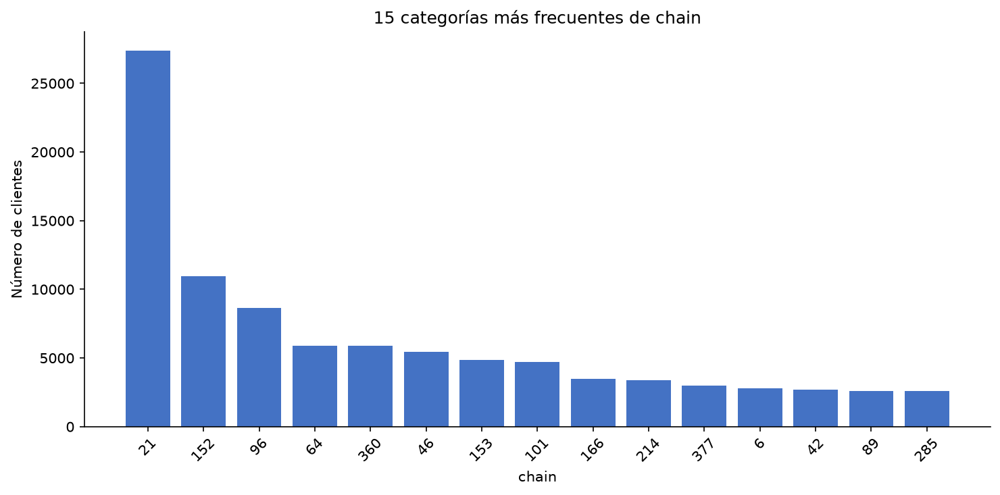
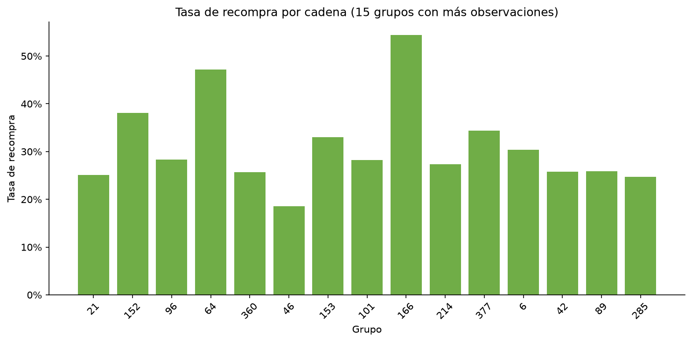
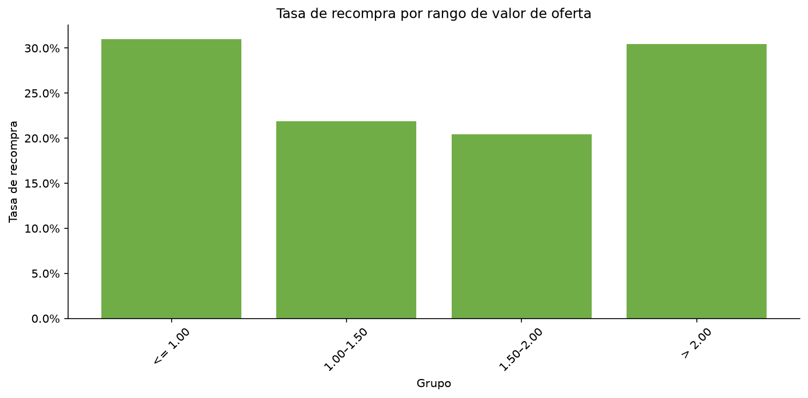
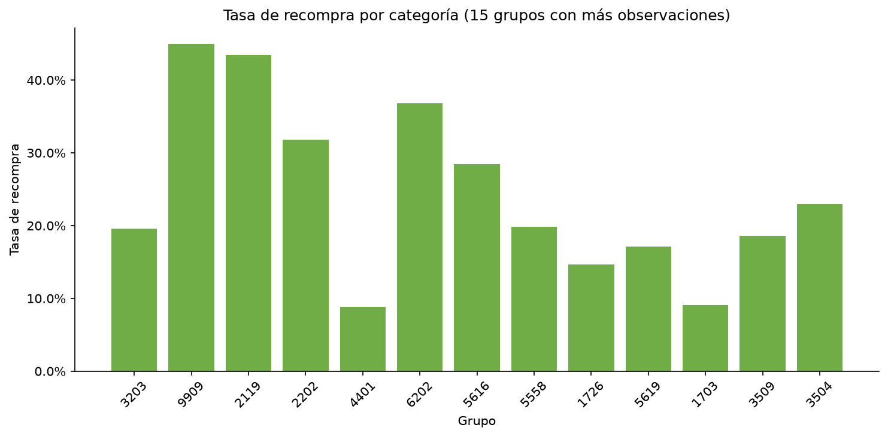
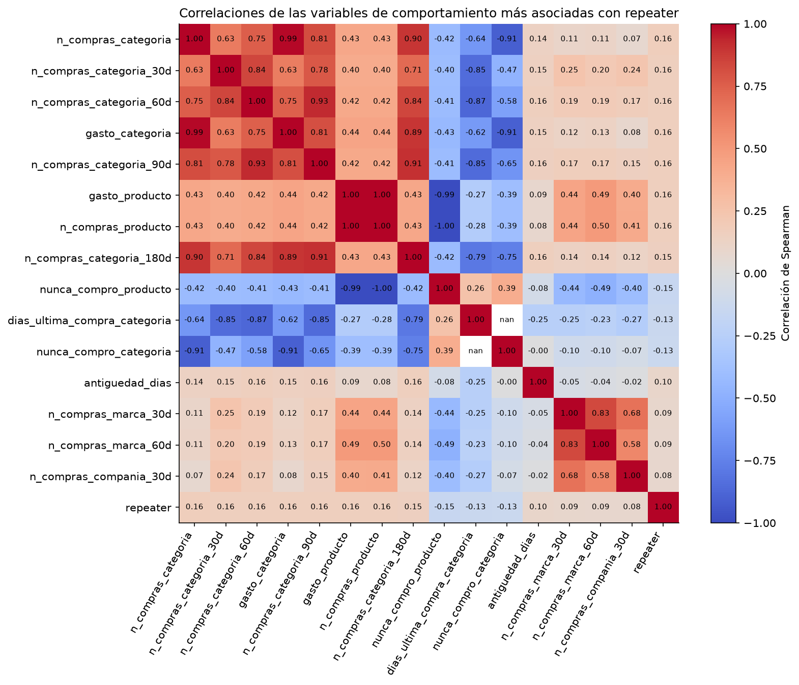

# 4. Análisis exploratorio categórico y cruces

Esta sección utiliza las 160,057 observaciones del dataset de modelo procesado. La proporción global de clientes que recompraron fue 27.14% (43,438 clientes). Los identificadores de cadena, mercado, categoría, compañía y marca están anonimizados; por ello se describen por sus frecuencias y no se les asigna significado comercial.

## 4.1 Distribución de variables categóricas

Se observaron 130 cadenas, 34 mercados, 13 categorías, 11 compañías y 12 marcas. La cadena 21 concentró 27,373 observaciones (17.10%) y el mercado 10 concentró 41,724 (26.07%). En la oferta, la categoría 3203 fue la más frecuente, con 45,652 clientes (28.52%), seguida por la categoría 9909 con 22,147 (13.84%). Las frecuencias completas están en las tablas `04_frecuencia_*` y los gráficos presentan solo los 15 grupos más frecuentes para facilitar su lectura.

## 4.2 Recompra por cadena

Las tasas variaron entre las cadenas con mayor número de observaciones. Por ejemplo, la cadena 21, la más frecuente, presentó una tasa de 25.14% con 27,373 clientes; las cadenas 64 y 166 registraron 47.22% (5,889 clientes) y 54.42% (3,499 clientes), respectivamente. En contraste, la cadena 46 presentó 18.53% con 5,440 clientes. Estas diferencias describen asociaciones por grupo y no implican una relación causal.

La tabla completa conserva las 130 cadenas y permite evaluar el tamaño de cada grupo antes de comparar tasas: [tabla de recompra por cadena](../../results/tables/04_tasa_recompra_chain.csv). La figura se limita a los 15 grupos con más observaciones.

## 4.3 Recompra según valor de la oferta

Los descuentos de hasta 1.00 tuvieron una tasa de recompra de 31.02% (93,859 clientes). Los rangos de 1.00–1.50 y 1.50–2.00 presentaron 21.91% y 20.41%, con 31,351 y 31,454 clientes, respectivamente. El rango superior a 2.00 alcanzó 30.47%, aunque reunió solo 3,393 observaciones. Por tanto, este último resultado debe interpretarse considerando su menor tamaño muestral.

## 4.4 Recompra por categoría

Las categorías de oferta también mostraron diferencias. Entre las de mayor frecuencia, la categoría 9909 tuvo una tasa de 44.93% con 22,147 clientes y la 2119 una de 43.44% con 18,767. La categoría 3203, que fue la más frecuente, presentó 19.58% con 45,652 clientes; la 4401 presentó 8.88% con 15,008. Los valores corresponden a IDs anónimos y no permiten identificar los productos representados.

La tabla completa está disponible en [recompra por categoría](../../results/tables/04_tasa_recompra_category.csv); el gráfico muestra solo las 15 categorías con más observaciones.

## 4.5 Correlaciones con la variable objetivo

Se calcularon correlaciones de Spearman entre `repeater` y las variables numéricas de comportamiento. Se excluyeron los IDs, los atributos categóricos de la oferta y `repeattrips`, ya que este último deriva directamente de la variable objetivo. Las asociaciones positivas de mayor magnitud fueron `n_compras_categoria` (0.164), `n_compras_categoria_30d` (0.164), `n_compras_categoria_60d` (0.164), `gasto_categoria` (0.161) y `n_compras_categoria_90d` (0.160). Ninguna correlación individual superó 0.164, por lo que las variables muestran una asociación monotónica limitada por separado.

Las compras previas del producto también se asociaron positivamente (`gasto_producto`: 0.159; `n_compras_producto`: 0.157), mientras que `nunca_compro_producto` presentó una asociación negativa (-0.152). El resumen ordenado y la matriz completa se encuentran en [correlaciones con `repeater`](../../results/tables/04_correlaciones_repeater.csv) y [matriz de correlación](../../results/tables/04_matriz_correlacion.csv).

## 4.6 Faltantes y valores atípicos

La única variable con faltantes fue `dias_ultima_compra_categoria`, con 72,639 casos (45.38%). El faltante representa clientes que nunca compraron previamente la categoría ofertada; por ello se conserva junto con la variable `nunca_compro_categoria`, en lugar de eliminar filas o imputar un valor que borraría esa información.

Se mantienen también los valores extremos. El EDA cuantitativo anterior mostró distribuciones de comportamiento con colas largas; en este dataset, `n_lineas` alcanzó 2,647,164, `gasto_total` 48,321,663.59 y `ticket_promedio` 116,157.85. Estos valores pueden reflejar comportamientos reales o registros de volumen inusual, y eliminarlos podría modificar las tasas de recompra por grupo. Por esa razón, se documentan sin retirar observaciones en esta etapa.

## 4.7 Hallazgos principales

1. La recompra global fue 27.14%, pero las tasas variaron entre cadenas y categorías anónimas incluso entre grupos con miles de observaciones.
2. Las ofertas de hasta 1.00 tuvieron la mayor tasa entre los rangos con amplio tamaño muestral (31.02%); el rango superior a 2.00 fue similar, pero tuvo menos casos.
3. Las compras y el gasto previos en la categoría ofertada concentraron las mayores correlaciones de Spearman con la recompra, aunque ninguna asociación individual fue alta.
4. El faltante de recencia de categoría es informativo y los valores extremos se conservan para no alterar la composición ni las tasas de los grupos.
