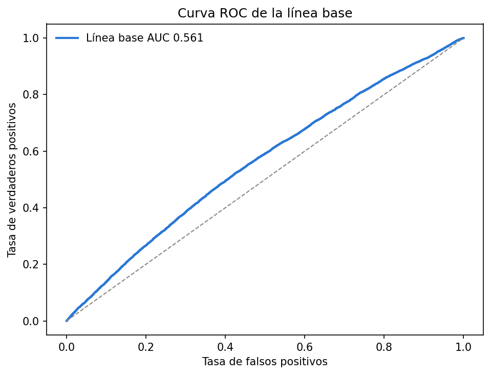

# Modelo preliminar y línea base

El primer modelo sirve como punto de comparación para medir si las variables creadas a partir del historial de compra aportan una mejora real. Se usó una regresión logística porque entrega una probabilidad de recompra y permite revisar el peso de cada variable.

## Separación de los datos

La validación respetó el orden de las ofertas. El entrenamiento contiene 124,558 clientes con fechas del 1 de marzo al 23 de abril de 2013. La validación contiene 35,499 clientes con fechas del 24 al 30 de abril de 2013. Ningún día aparece en los dos grupos.

La tasa de recompra fue 24.64% en entrenamiento y 35.91% en validación. Esta diferencia muestra que el comportamiento cambió en la última semana. Una separación al azar habría mezclado esas fechas y podría dar una medida demasiado optimista.

La división completa se encuentra en [la tabla del corte temporal](../../results/tables/05_split_temporal.csv).

## Variables y preparación

La línea base usa el valor de la oferta, la cantidad ofrecida, los días desde la última compra, el número de visitas, el gasto total, el ticket promedio y la antigüedad del historial. Los valores faltantes se reemplazan con la mediana calculada solamente en entrenamiento. Luego las variables se escalan y se aplica balanceo de clases dentro de la regresión logística.

Se dejaron fuera `id`, `offer`, `repeattrips` y `repeater`. `id` y `offer` son identificadores. `repeattrips` indica el número de recompras que ocurrió después de la oferta y usarlo permitiría que el modelo conociera la respuesta que debe predecir. `repeater` se conserva únicamente como variable objetivo.

## Resultado

La línea base obtuvo un AUC de 0.561 en la validación temporal. Un AUC de 0.500 equivale a ordenar los casos casi al azar. El resultado de 0.561 indica que las variables generales del cliente contienen una señal pequeña, pero todavía separan poco a quienes recompran de quienes no recompran.

Los valores exactos están en [las métricas de la línea base](../../results/tables/05_metricas_linea_base.csv) y [sus coeficientes](../../results/tables/05_coeficientes_linea_base.csv). El pipeline entrenado está guardado en `results/modelos/05_regresion_logistica_linea_base.joblib`.
