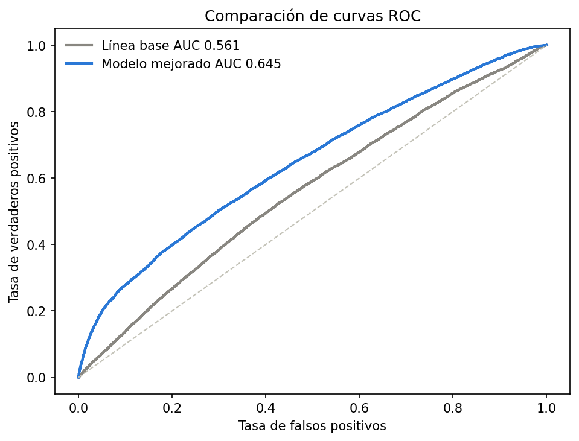
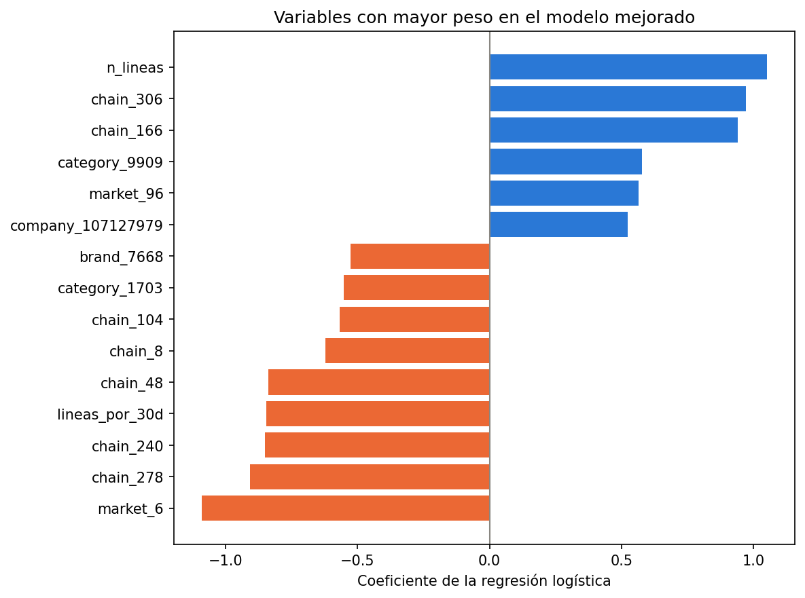

# Mejora del modelo con variables avanzadas

El segundo modelo mantiene la regresión logística y agrega las señales encontradas durante el análisis exploratorio. Así la comparación cambia las variables y su preparación, pero conserva el mismo corte temporal usado por la línea base.

## Variables agregadas

Se incluyeron todas las medidas disponibles del comportamiento anterior a la oferta y los identificadores anónimos de cadena, mercado, categoría, compañía y marca. También se crearon tasas por cada 30 días de historial, compras por visita, proporciones de compra en la categoría, marca y producto ofrecidos, recencia relativa de la categoría y una señal para volúmenes extremos.

Las variables numéricas tienen colas largas y algunos montos negativos. Para reducir el efecto de los valores muy grandes se aplicó una transformación logarítmica que conserva el signo. Los faltantes se reemplazaron con la mediana y se agregó una señal que indica su presencia. Las variables de grupo se convirtieron a columnas binarias. Todo el ajuste se hizo solamente con el conjunto de entrenamiento.

## Comparación de resultados

El modelo mejorado obtuvo un AUC de 0.645 en la misma validación temporal. La línea base obtuvo 0.561. La diferencia fue 0.083 puntos de AUC, o sea 8.33 puntos al expresarla sobre una escala de cien.

La mejora muestra que el historial relacionado con la oferta y los grupos anónimos aportan información que no estaba en las medidas generales de la línea base. Los coeficientes de los grupos indican asociaciones dentro de este modelo y no permiten afirmar que una cadena, mercado o categoría cause la recompra.

La comparación completa está en [la tabla de modelos](../../results/tables/06_comparacion_modelos.csv) y los pesos están en [la tabla de coeficientes](../../results/tables/06_coeficientes_modelo_mejorado.csv). El pipeline está guardado en `results/modelos/06_regresion_logistica_mejorada.joblib`.

## Revisión con ofertas separadas

También se hizo una revisión adicional donde las ofertas de entrenamiento no aparecen en validación. Se usaron 19 ofertas para entrenar y 5 para validar. En esta prueba la línea base obtuvo un AUC de 0.459 y el modelo mejorado obtuvo 0.669.

Este resultado ayuda a revisar el comportamiento ante ofertas distintas, pero corresponde a una sola división y no sustituye la validación temporal principal. La tabla se encuentra en [la validación con ofertas separadas](../../results/tables/06_validacion_ofertas_separadas.csv).

## Hallazgos y conclusiones

La tasa general de recompra del dataset fue 27.14%, aunque aumentó a 35.91% en la última semana usada para validación. Esto confirma que la fecha debe conservarse al medir el modelo.

Las compras y el gasto previos en la categoría, marca o producto de la oferta fueron más útiles que usar solamente el gasto y las visitas generales del cliente. Las tasas y proporciones también permiten comparar clientes con historiales de distinta duración.

Los valores extremos se conservaron y se redujo su peso con la transformación logarítmica. El faltante de recencia de categoría también se mantuvo como información porque aparece cuando un cliente no había comprado esa categoría.

El AUC de 0.645 representa una mejora clara frente a la línea base, pero todavía deja espacio para probar otros modelos y más formas de validación. Antes de preparar una entrega para Kaggle conviene repetir la validación por ofertas, revisar la calibración de las probabilidades y entrenar la versión elegida con todos los datos etiquetados.
